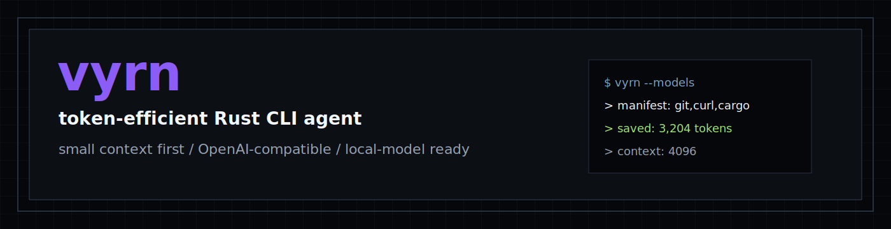

<div align="center">
  

  <p><strong>Build for the smallest viable context first.</strong></p>

  <p>
    
    <a href="https://brunov21.github.io/vyrn/"></a>
    
    
    
  </p>
</div>

Most agent tools assume they can spend 128K+ context windows and still feel fast. For local or small OpenAI-compatible models running on constrained hardware, that is often the wrong default: large always-loaded prompts increase memory pressure, slow turns down, and waste tokens before useful work starts.

vyrn is a token-efficient, model-agnostic CLI agent built in Rust for developers and terminal-native users running local or small LLMs. It keeps the always-loaded prompt and tool surface tiny, uses raw shell batching as the main power primitive, and tracks token savings as a first-class product signal.

The interactive interface uses native terminal scrollback with `crossterm` raw-mode input. Real terminals get styled prompts, live streaming output, slash-command autocomplete, inline `/models` selection, running indicators, compact tool previews, and a composer status row; piped or scripted runs fall back to plain text.

```text
┌──────────────┐   compact prompt    ┌──────────────┐
│ User / TTY   │ ──────────────────> │ vyrn agent   │
│              │ <────────────────── │ stream +     │
│ local task   │  answer + stats     │ token stats  │
└──────────────┘                     └──────┬───────┘
                                            │
                            OpenAI-compatible chat API
                                            │
                                     ┌──────▼───────┐
                                     │ local/small  │
                                     │ LLM endpoint │
                                     └──────────────┘
```

## Why vyrn?

- **Small context first:** the system prompt, core tools, manifest, and history strategy are designed for tight context windows.
- **Model-agnostic:** any OpenAI-compatible endpoint can work, including Ollama, LM Studio, Groq, Together AI, OpenRouter, or a custom local server.
- **Raw power primitive:** `batch` is the main extension point for shell work, installs, scripts, and host inspection.
- **Terminal UI:** real terminal sessions use a styled native-scrollback chat surface instead of a bare line prompt.
- **Rolling summaries:** conversation history is compressed into a living summary instead of resent wholesale on every turn.
- **Visible savings:** each completed request reports tokens spent, history saved, session history saved, and current context footprint.
- **Open standards:** skills follow Agent Skills protocol, and MCP config follows `.mcp.json` conventions.

## Installation

For local development, use a checkout:

```bash
git clone https://github.com/BrunoV21/vyrn.git
cd vyrn
cargo build
cargo test
cargo run -- --help
```

Once published, the Rust package is intended to install with Cargo:

```bash
cargo install vyrn
vyrn
```

## Quick Start

Create a model profile for an OpenAI-compatible local endpoint:

```toml
# .vyrn/models.toml
[models.llama3]
base_url = "http://localhost:11434/v1"
model = "llama3.2"
api_key = ""
```

Start an interactive session:

```bash
cargo run -- --models
```

Use Up/Down and Enter to choose a configured model profile. `--model` is accepted
as an alias.

Expected session shape:

```text
+------------------------------------------------------+
|          __     __ __   __ ____  _   _              |
|          \ \   / / \ \ / /|  _ \| \ | |             |
|           \ \ / /   \ V / | |_) |  \| |             |
|            \ V /     | |  |  _ <| |\  |             |
|             \_/      |_|  |_| \_\_| \_|             |
+------------------------------------------------------+

model glm-4-5-air  context 4096
> /mo<Tab>
> /models
```

The composer status row under the input box shows cumulative model I/O for the
request, prior-history summary savings, session history savings, and the current
prompt footprint against the configured context window:

```text
turn spent: 225 | turn history saved: 29 | session history saved: 18 | context: 342/4,096
```

Press `Esc` while a turn is running to cancel it and return to the composer. Press
Up/Down in the composer to recall previous non-command prompts.

Vision-capable models can receive images as part of the current message. In the TTY
composer, press `Ctrl+V` with an image on the clipboard to attach it. You can also paste
or type image paths such as `./screen.png` or `~/Pictures/mock.jpg`; `png`, `jpg`,
`jpeg`, `webp`, and `gif` files are encoded as base64 data URLs in the OpenAI request.
Multiple images can be attached to one message.

Inside a session, local control commands are handled by vyrn:

```text
/models     switch model profile
/stats      show token usage
/manifest   print compact machine manifest
/refresh    rescan manifest
/skills     list discovered skills
/clear      reset session context and clear the terminal
/exit       close the session
```

## Development

Run the Rust package from source:

```bash
cargo build
cargo test
cargo run -- --models
```

Use `--debug` when a provider request fails:

```bash
cargo run -- --debug
```

Debug mode shows the request URL, lower-level network error details, and provider
response bodies for non-2xx HTTP responses.

Run the deterministic end-to-end REPL test:

```bash
cargo test --test e2e_repl -- --nocapture
```

That test starts a local fake OpenAI-compatible `/v1/chat/completions` streaming server,
writes a temporary `.vyrn/models.toml`, pipes input into the real `vyrn` binary, and
verifies that a model tool call reads a file through the REPL.

The current product requirements live in [`docs/prd.md`](docs/prd.md). Keep implementation, CLI behavior, and documentation aligned with that file until the product scope changes.

The developer implementation blueprint lives in [`docs/architecture/architecture.md`](docs/architecture/architecture.md).

## Documentation

Official docs live in [`docs/official`](docs/official).
Agents should use the raw Markdown index: [`docs/official/agents.md`](https://raw.githubusercontent.com/BrunoV21/vyrn/main/docs/official/agents.md).
Brand positioning and story notes live in [`docs/branding`](docs/branding).

```bash
cd docs/official
npm install
npm run docs:dev
```

The docs use a terminal-brutalist standard: black surfaces, violet brand/action states, steel-blue technical accents, and compact agent-readable pages.

## Implemented Surface

- Rust CLI package with a styled native-scrollback TTY interface and a plain-text fallback for pipes.
- OpenAI-compatible streaming chat completions client.
- Core tools: `read_file`, `read_image`, `write_file`, `edit_file`, `batch`, `refresh_manifest`.
- Compact machine manifest for binaries, skills, and MCP server metadata.
- Config/model loading from `.vyrn/` and `~/.vyrn/`, with global vyrn config overriding local settings.
- Rolling summary context manager and visible token savings ledger.
- Agent Skills discovery by name and description.
- `.mcp.json` parsing and merge precedence for Phase 2 MCP integration.

MCP server execution is intentionally still Phase 2 work.

## License

MIT
