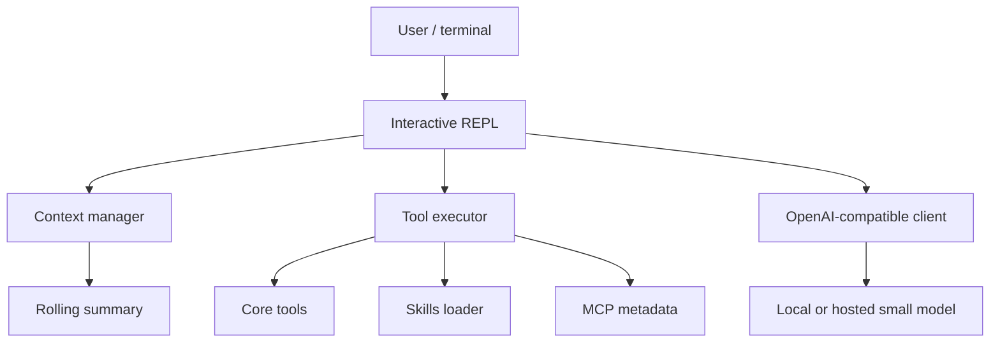

# Architecture

vyrn is a terminal-native Rust agent organized around a small interactive loop.

## Main components

| Component | Responsibility |
|---|---|
| Interactive REPL | Reads user requests, streams model output, displays tool activity and token stats. |
| Context manager | Maintains rolling summaries and adjusts pruning as the context budget tightens. |
| LLM client | Uses OpenAI `/v1/chat/completions` compatible streaming. |
| Tool executor | Runs the compact core toolset and `batch`. |
| Machine manifest | Injects a tiny environment snapshot into the prompt. |
| Skills loader | Implements Agent Skills progressive disclosure. |
| MCP metadata | Parses `.mcp.json` server metadata for the manifest. MCP server execution is Phase 2. |

## Current implementation

- Line-oriented interactive REPL.
- Native-scrollback terminal UI for TTY sessions, with slash autocomplete and plain-text fallback for pipes.
- OpenAI-compatible streaming chat completions client.
- Core tools: `read_file`, `write_file`, `edit_file`, `batch`, `refresh_manifest`.
- Rolling summary context manager and token savings ledger.
- Agent Skills discovery by name and description.
- `.mcp.json` metadata parsing and merge precedence.
- Deterministic end-to-end REPL test against a fake OpenAI-compatible streaming server.

## Scope

vyrn is not a GUI, hosted inference service, RAG system, or multi-agent framework. The product is a Rust CLI package focused on making local and small-model agent sessions practical.
