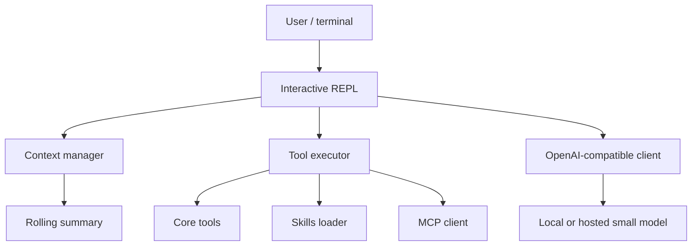

# Architecture

vyrn is a terminal-native Rust agent organized around a small interactive loop.

## Main components

| Component | Responsibility |
|---|---|
| Interactive REPL | Reads user requests, streams model output, displays tool activity and token stats. |
| Context manager | Maintains rolling summaries and adjusts pruning as the context budget tightens. |
| LLM client | Uses OpenAI `/v1/chat/completions` compatible streaming. |
| Tool executor | Runs the compact core toolset and `batch`. |
| Machine manifest | Injects a tiny environment snapshot into the prompt. |
| Skills loader | Implements Agent Skills progressive disclosure. |
| MCP client | Loads `.mcp.json` servers in eager or discovery mode. |

## Scope

vyrn is not a GUI, hosted inference service, RAG system, or multi-agent framework. The product is a Rust CLI package focused on making local and small-model agent sessions practical.
