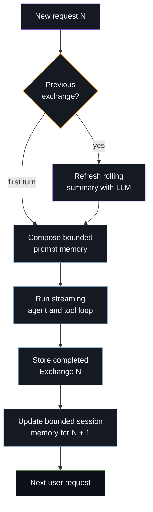
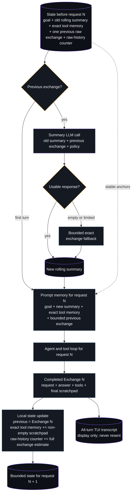
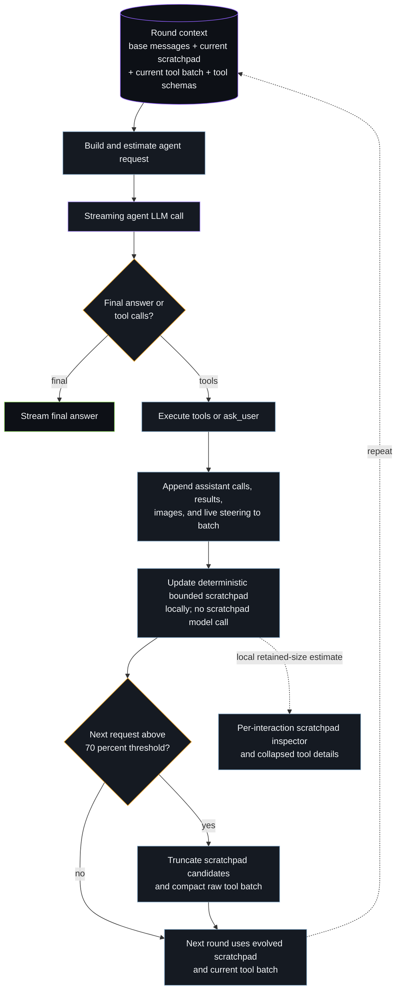
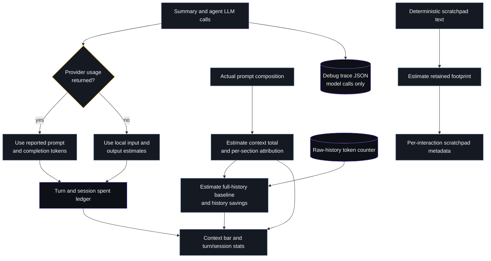

# Architecture

vyrn is a terminal-native Rust agent organized around a small interactive loop.
The important boundary is between session memory, which survives into later user
turns, and current-turn context, which exists only while the agent is chaining
tool calls.

```mermaid
flowchart TB
  User["New request N"] --> Previous{"Previous<br/>exchange?"}
  Previous -- "yes" --> Refresh["Refresh rolling<br/>summary with LLM"]
  Previous -- "first turn" --> Memory["Compose bounded<br/>prompt memory"]
  Refresh --> Memory
  Memory --> Agent["Run streaming<br/>agent and tool loop"]
  Agent --> Exchange["Store completed<br/>Exchange N"]
  Exchange --> Next["Update bounded session<br/>memory for N + 1"]
  Next --> Repeat["Next user request"]

  classDef input fill:#151A22,stroke:#8B5CF6,color:#F3F7FB
  classDef model fill:#151A22,stroke:#A78BFA,color:#F3F7FB
  classDef local fill:#151A22,stroke:#7DA2C2,color:#F3F7FB
  classDef decision fill:#151A22,stroke:#F5A524,color:#F3F7FB
  classDef output fill:#0D1016,stroke:#9FE870,color:#F3F7FB
  class User input
  class Refresh model
  class Memory,Agent,Exchange,Next local
  class Previous decision
  class Repeat output
```

The overview contains two distinct compression paths. The first rewrites memory
between user turns; the second keeps tool context bounded inside one user turn.

## Between-turn memory flow

```mermaid
flowchart TB
  Before[("State before request N<br/>goal + old rolling summary + exact tool memory<br/>+ one previous raw exchange + raw-history counter")]
  Before --> HasPrevious{"Previous exchange?"}
  HasPrevious -- "yes" --> SummaryCall["Summary LLM call<br/>old summary + previous exchange + policy"]
  SummaryCall --> Valid{"Usable response?"}
  Valid -- "yes" --> NewSummary[("New rolling summary")]
  Valid -- "empty or limited" --> Fallback["Bounded exact<br/>exchange fallback"]
  Fallback --> NewSummary
  HasPrevious -- "first turn" --> Prompt
  NewSummary --> Prompt
  Before -. "stable anchors" .-> Prompt["Prompt memory for request N<br/>goal + new summary + exact tool memory<br/>+ bounded previous exchange"]
  Prompt --> Agent["Agent and tool loop for request N"]
  Agent --> Completed["Completed Exchange N<br/>request + answer + tools + final scratchpad"]
  Completed --> Update["Local state update<br/>previous = Exchange N<br/>exact tool memory += non-empty scratchpad<br/>raw-history counter += full exchange estimate"]
  Update --> After[("Bounded state for request N + 1")]
  Completed --> Transcript[("All-turn TUI transcript<br/>display only; never resent")]

  classDef model fill:#151A22,stroke:#A78BFA,color:#F3F7FB
  classDef store fill:#0D1016,stroke:#8B5CF6,color:#F3F7FB
  classDef local fill:#151A22,stroke:#7DA2C2,color:#F3F7FB
  classDef decision fill:#151A22,stroke:#F5A524,color:#F3F7FB
  class Before,NewSummary,After,Transcript store
  class SummaryCall model
  class Fallback,Prompt,Agent,Completed,Update local
  class HasPrevious,Valid decision
```

The summary call sees the previous exchange and old summary. Agent calls receive
the newly composed prompt memory: session goal, rewritten summary, exact tool
memory, and a bounded anchor of that same previous exchange. Older raw exchanges
are not retained as model messages.

## Within-turn tool flow

```mermaid
flowchart TB
  Round[("Round context<br/>base messages + current scratchpad<br/>+ current tool batch + tool schemas")] --> Request["Build and estimate agent request"]
  Request --> Agent["Streaming agent LLM call"]
  Agent --> Decision{"Final answer or<br/>tool calls?"}
  Decision -- "final" --> Final["Stream final answer"]
  Decision -- "tools" --> Tools["Execute tools or ask_user"]
  Tools --> Append["Append assistant calls, results,<br/>images, and live steering to batch"]
  Append --> Checkpoint["Update deterministic bounded scratchpad<br/>locally; no scratchpad model call"]
  Checkpoint --> Pressure{"Next request above<br/>70 percent threshold?"}
  Pressure -- "yes" --> Compact["Truncate scratchpad candidates<br/>and compact raw tool batch"]
  Pressure -- "no" --> NextRound["Next round uses evolved scratchpad<br/>and current tool batch"]
  Compact --> NextRound
  NextRound -. "repeat" .-> Round
  Checkpoint -. "local retained-size estimate" .-> Inspect["Per-interaction scratchpad inspector<br/>and collapsed tool details"]

  classDef model fill:#151A22,stroke:#A78BFA,color:#F3F7FB
  classDef store fill:#0D1016,stroke:#8B5CF6,color:#F3F7FB
  classDef local fill:#151A22,stroke:#7DA2C2,color:#F3F7FB
  classDef decision fill:#151A22,stroke:#F5A524,color:#F3F7FB
  classDef output fill:#0D1016,stroke:#9FE870,color:#F3F7FB
  class Agent model
  class Round store
  class Request,Tools,Append,Checkpoint,Compact,NextRound,Inspect local
  class Decision,Pressure decision
  class Final output
```

The current-turn scratchpad starts empty. Each completed tool batch extends it
locally with a bounded deterministic checkpoint. Until pressure triggers
compaction, the next agent round can contain both that checkpoint and the current
raw tool batch. The checkpoint has an estimated retained size but no generation
cost because it does not make an LLM call.

## Token accounting and observability

```mermaid
flowchart TB
  Calls["Summary and agent LLM calls"] --> Usage{"Provider usage<br/>returned?"}
  Usage -- "yes" --> Provider["Use reported prompt<br/>and completion tokens"]
  Usage -- "no" --> Fallback["Use local input and<br/>output estimates"]
  Provider --> Ledger["Turn and session spent ledger"]
  Fallback --> Ledger

  Prompt["Actual prompt composition"] --> Sections["Estimate context total<br/>and per-section attribution"]
  Raw[("Raw-history token counter")] --> Savings["Estimate full-history baseline<br/>and history savings"]
  Sections --> Savings
  Scratch["Deterministic scratchpad text"] --> ScratchSize["Estimate retained footprint"]

  Ledger --> Stats["Context bar and turn/session stats"]
  Sections --> Stats
  Savings --> Stats
  ScratchSize --> Inspect["Per-interaction scratchpad metadata"]
  Calls --> Trace[("Debug trace JSON<br/>model calls only")]

  classDef model fill:#151A22,stroke:#A78BFA,color:#F3F7FB
  classDef store fill:#0D1016,stroke:#8B5CF6,color:#F3F7FB
  classDef local fill:#151A22,stroke:#7DA2C2,color:#F3F7FB
  classDef decision fill:#151A22,stroke:#F5A524,color:#F3F7FB
  class Calls model
  class Raw,Ledger,Trace store
  class Provider,Fallback,Prompt,Sections,Savings,Scratch,ScratchSize,Stats,Inspect local
  class Usage decision
```

## Memory lifetimes

The TUI transcript and the model's conversation context are deliberately
different things. Keeping the distinction explicit prevents an old scratchpad
from being counted as if it were still a direct part of the current prompt.

| Artifact | Produced by | Lifetime | Where it is sent | Token source |
|---|---|---|---|---|
| TUI transcript history | Local UI events | Full in-process session | Never sent as conversation history | Not applicable |
| Previous raw exchange | Completed agent turn | Until the following turn completes | Summary refresh and a bounded prompt-memory anchor | Local estimate when measuring history |
| Rolling summary | Summary LLM call, with an exact fallback | Session, rewritten before each non-initial turn | Prompt memory for agent calls | Provider usage for generation; local estimate inside a prompt breakdown |
| Exact tool memory | Final deterministic turn scratchpads | Session, bounded to recent head and tail | Prompt memory for agent calls | Local estimate |
| Current-turn scratchpad | Local deterministic tool-batch checkpoint | One user turn; copied to the exchange and exact tool memory | Later agent rounds in the same turn | Local estimate; there is no scratchpad model call |
| Current tool batch | Tool execution and live steering | Current agent round, compacted under pressure | The next agent round | Local estimate within the request; provider reports only the whole prompt |
| Raw-history token counter | Completed exchanges | Session | Never sent; used only for the counterfactual savings estimate | Local estimate |

Consequently, `scratch 0` in a context breakdown means the latest agent request
did not directly contain a current-turn scratchpad. It does not mean older tool
facts disappeared: they can survive in the rolling summary, exact tool memory,
the bounded previous-exchange anchor, and the inspectable TUI interaction.

Token totals also answer two different questions. Provider usage measures the
actual input and output charged for summary and agent calls when the endpoint
returns it. Context composition, per-section attribution, scratchpad footprint,
the raw-history baseline, and history savings remain local estimates because an
OpenAI-compatible response does not report per-message token attribution.

## Main components

| Component | Responsibility |
|---|---|
| Interactive REPL | Reads user requests, streams model output, displays tool activity, clarification prompts, and token stats. |
| Context manager | Maintains rolling summaries and adjusts pruning as the context budget tightens. |
| LLM client | Uses OpenAI `/v1/chat/completions` compatible streaming. |
| Debug traces | Records debug-only structured LLM request/response JSON for REPL sessions and eval cases. |
| Tool executor | Runs the compact core toolset, `batch`, and human clarification handoff. |
| Machine manifest | Injects a tiny environment snapshot into the prompt. |
| Skills loader | Implements Agent Skills progressive disclosure. |
| MCP metadata | Parses `.mcp.json` server metadata for the manifest. MCP server execution is Phase 2. |

## Current implementation

- Line-oriented interactive REPL.
- Native-scrollback terminal UI for TTY sessions, with slash autocomplete and plain-text fallback for pipes.
- OpenAI-compatible streaming chat completions client.
- Debug-only LLM trace JSON plus a local static trace viewer.
- Core tools: `read_file`, `read_image`, `write_file`, `edit_file`, `batch`, `ask_user`, `refresh_manifest`.
- Template-based prompt assembly for agent and summary prompts.
- Rolling summary context manager and token savings ledger.
- Agent Skills discovery by name and description.
- `.mcp.json` metadata parsing and merge precedence.
- Deterministic end-to-end REPL test against a fake OpenAI-compatible streaming server.

## Scope

vyrn is not a GUI, hosted inference service, RAG system, or multi-agent framework. The product is a Rust CLI package focused on making local and small-model agent sessions practical.
